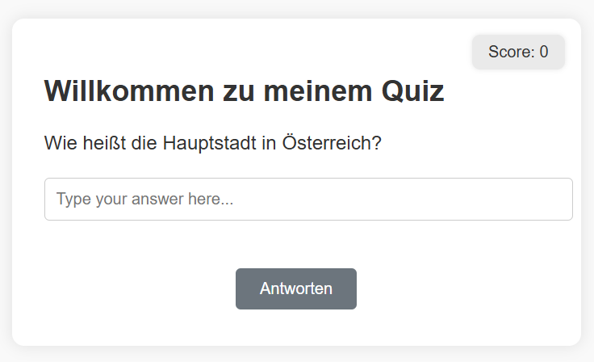

# 🇦🇹 Quiz App – JavaScript Project

This is a simple interactive quiz app built with vanilla JavaScript, HTML, and CSS.  
It asks the user a few questions and provides instant feedback.

---

## ✨ Features

- Real-time input checking
- Enter key or button for submission
- Dynamic score counter
- Visual feedback for correct and incorrect answers
- Custom result message based on performance
- Restart button to try the quiz again

---

## 📦 Tech Stack

- HTML
- CSS
- JavaScript (vanilla, no frameworks)

---

## 🧠 Learning Focus

This project was part of the **ADA & Florence course**, refactored and improved to:

- Write modular and readable JavaScript
- Separate logic (validation, feedback, score, result)
- Practice working with the DOM dynamically
- Build small reusable functions
- Write clean code with meaningful comments

---

## 📸 Screenshot



---

## 🚀 Getting Started

1. Clone the repo:
```bash
git clone https://github.com/yourusername/quiz-app.git

2. Open `index.html` in your browser  
   _(You can also use Live Server in VS Code)_

---

## 🔁 Future Improvements

- ⏱️ Timer or countdown for each question  
- 💾 Save best scores using LocalStorage  
- 🌐 Language switch (DE / EN)  
- 📱 Responsive mobile layout

---

## 💡 Author

Built with ❤️ by Grinchuk Nadezda  
Part of my web development learning journey.